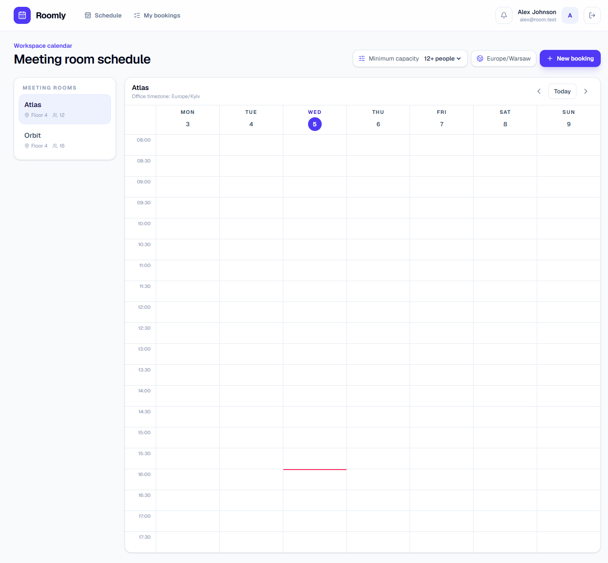
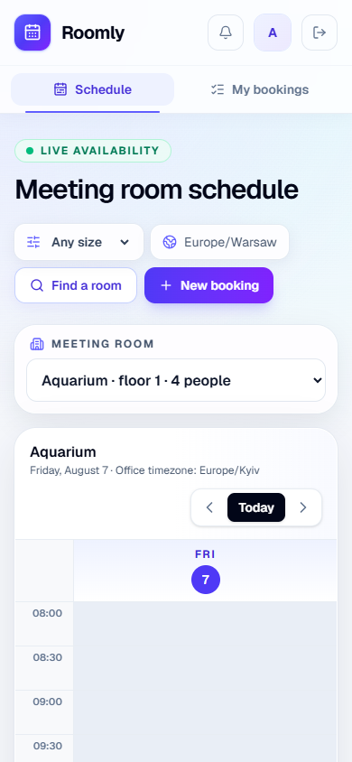
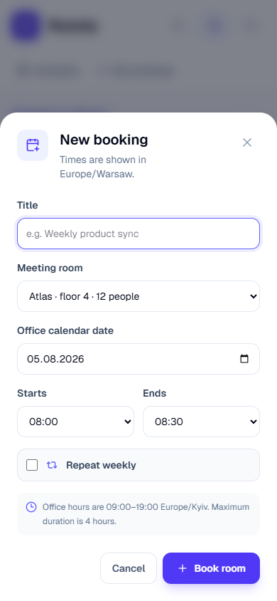
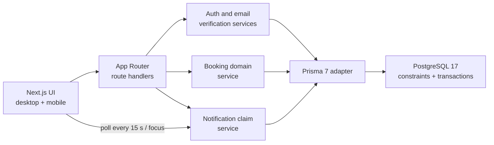

# Roomly — meeting room reservations

[](https://github.com/Deversatorg/room-reservation-ua-skills/actions/workflows/ci.yml)


Roomly is a timezone-aware meeting-room reservation application built for the UA-Skills event2 competition. It combines a hand-built calendar, strict server-side booking rules, database-level race protection, weekly series, email verification, and exactly-once in-app handoff notifications.

**Live demo:** [https://roomly-ua-skills.vercel.app](https://roomly-ua-skills.vercel.app)

## Product preview



<p align="center">
  
  
</p>

## Run with one command

Requirements: Docker Desktop with Docker Compose.

```bash
docker compose up --build
```

Open [http://localhost:3000](http://localhost:3000). The application waits for PostgreSQL, deploys all migrations, runs the idempotent seed, and starts only after the database is healthy.

Demo accounts are already email-verified:

| Name | Email | Password |
| --- | --- | --- |
| Alex Johnson | `alex@room.test` | `DemoPass123!` |
| Maria Novak | `maria@room.test` | `DemoPass123!` |

The seed creates six meeting rooms, ordinary reservations, and a three-occurrence weekly series.

## Competition requirements

| Requirement | Implementation | How to verify |
| --- | --- | --- |
| Registration and sign-in | Argon2id passwords, hashed database sessions, `httpOnly` cookie | Register at `/register`; sign in with a demo account |
| Room list | Six seeded rooms with floor and capacity | Open `/schedule` or `GET /api/rooms` |
| Weekly room schedule | Custom CSS Grid; events show title and author | Select a room and navigate between weeks |
| Timezone support | Office rules use `Europe/Kyiv`; the browser uses its detected IANA zone and labels office days that cross a local date boundary | Compare the office date with the timezone badge and displayed slots; run the Los Angeles/Tokyo E2E cases |
| Booking validation | Future-only, 30-minute steps, 30 minutes–4 hours, 09:00–19:00 Kyiv | Try an invalid request or run `npm run test:integration` |
| Conflict handling | Friendly API check plus PostgreSQL GiST exclusion constraint | Run the simultaneous race test |
| Cancellation rights | Soft cancellation; only the author may cancel | Try cancelling Alex's booking as Maria in API tests |
| Personal history | Upcoming/past tabs, deep links back to the schedule | Open **My bookings** |

## All 8 bonus features

| Bonus | Evidence in the implementation | Automated proof |
| --- | --- | --- |
| 1. Docker Compose | PostgreSQL 17 healthcheck, migration/seed startup, app healthcheck | `docker compose up --build` |
| 2. Race-condition protection | Partial GiST exclusion constraint on active `tstzrange` intervals | API race test and `npm run test:race` |
| 3. Email verification | SHA-256 token hash, 24-hour expiry, 60-second resend cooldown, unverified-booking guard | Unit and API integration tests |
| 4. Weekly recurring bookings | 2–12 occurrences, Kyiv wall-clock DST handling, atomic transaction, occurrence/future cancellation | Unit, API, and E2E tests |
| 5. Exactly-once notifications | Locked current/next bookings, unique current booking, 15-second/focus polling, toast and history | Concurrent poll API test and notification E2E |
| 6. API integration tests | Registration, auth guard, conflicts, hours, ownership, series, race, notifications | `npm run test:integration` |
| 7. Capacity filter | `GET /api/rooms?minCapacity=N`, URL persistence, automatic valid-room selection | API and desktop E2E tests |
| 8. Mobile day calendar | One-day view below 768 px, swipe/day navigation, room selector, sticky times, bottom sheet | 390 px E2E with overflow/focus assertions |

## Architecture



The larger concerns are separated into domain services and focused UI components:

- `booking-service.ts` owns create/cancel transactions and maps domain errors.
- `booking-series.ts` generates DST-safe weekly occurrences at the same Kyiv local time.
- `notification-service.ts` atomically claims eligible handoffs and guarantees deduplication.
- `email-verification.ts` creates, hashes, expires, and logs development verification tokens.
- `booking-dialog.tsx` isolates recurrence form state and accessible dialog behaviour.
- `use-accessible-dialog.ts` provides Escape, Tab trapping, initial focus, scroll locking, and focus restoration.

### Time and conflict guarantees

`Booking.startAt` and `Booking.endAt` are PostgreSQL `timestamptz` values and cross the API as UTC ISO strings. The server converts the instants to `Europe/Kyiv` before validating the office window. The browser independently converts every event and slot to its detected IANA timezone; no fixed UTC offset is assumed.

Intervals are half-open: `[start, end)`. Therefore `10:00–11:00` and `11:00–12:00` are valid neighbours. A partial PostgreSQL GiST exclusion constraint rejects overlapping active `tstzrange` values in the same room, so two concurrent requests have exactly one winner. Soft-cancelled intervals no longer participate in the constraint.

Weekly occurrences are calculated from the Kyiv wall clock and converted to UTC one by one. A daylight-saving change therefore preserves the meeting's local time instead of preserving an incorrect fixed offset.

## Public API

| Method | Route | Purpose |
| --- | --- | --- |
| `POST` | `/api/auth/register` | Create an unverified account and session |
| `POST` | `/api/auth/login`, `/api/auth/logout` | Start or end a session |
| `GET` | `/api/auth/session` | Return the current user and `emailVerified` |
| `POST` | `/api/auth/verify-email` | Consume a one-time verification token |
| `POST` | `/api/auth/resend-verification` | Rate-limited token replacement |
| `GET` | `/api/rooms?minCapacity=N` | List or filter rooms |
| `GET`, `POST` | `/api/bookings` | Read a room range or create one/recurring bookings |
| `DELETE` | `/api/bookings/:id?scope=occurrence\|series` | Cancel one occurrence or all future occurrences |
| `GET` | `/api/me/bookings?status=upcoming\|past` | Personal booking history |
| `POST` | `/api/notifications/poll` | Atomically claim newly eligible notifications |
| `GET` | `/api/notifications` | Notification history |
| `PATCH` | `/api/notifications/:id/read` | Mark a notification as read |
| `GET` | `/api/health` | Runtime and database health |

Errors consistently use `{ "error": { "code", "message", "fieldErrors?" } }` and meaningful `401`, `403`, `404`, `409`, and `422` statuses.

## Local development

Requirements: Node.js 24 LTS, npm, Docker, and `.env.example` copied to `.env`.

```bash
docker compose up db -d
npm ci
npm run db:deploy
npm run db:seed
npm run dev
```

New accounts remain signed in but cannot book until verified. With `EMAIL_VERIFICATION_MODE=log`, the raw token is never returned by the API; the development link appears only in the server log:

```bash
docker compose logs app
```

## Test matrix

```bash
npm test                 # 24 Vitest unit tests
npm run test:integration # 5 Playwright API tests
npm run test:e2e         # 7 Chromium UI/Axe tests
npm run test:browser     # all 12 browser/API tests on a fresh test DB
npm run test:race        # standalone database race proof
npm run lint
npm run build
npm audit --audit-level=high
```

The Playwright runner refuses any database whose name is not exactly `roomly_test`. Locally it creates an ephemeral PostgreSQL 17 Compose service on port 5433, deploys migrations, seeds it, runs with one worker, and removes only that test container. CI uses an isolated PostgreSQL 17 service and uploads traces/screenshots on failure.

Accessibility acceptance is explicit: Axe must report zero `serious` or `critical` violations on login, registration, schedule, and My bookings. E2E also checks the 390 px layout, horizontal overflow, bottom-sheet position, focus trap, Escape, and focus restoration.

## Configuration

| Variable | Purpose | Default/example |
| --- | --- | --- |
| `DATABASE_URL` | Runtime connection; use Neon pooled URL in production | local PostgreSQL URL |
| `DIRECT_DATABASE_URL` | Migration/seed connection; use Neon direct URL | falls back to `DATABASE_URL` |
| `EMAIL_VERIFICATION_MODE` | `log` writes verification links to server logs | `log` |
| `NOTIFY_BEFORE_MINUTES` | Notification eligibility window | `10` |

## Deployment

Production is live on [roomly-ua-skills.vercel.app](https://roomly-ua-skills.vercel.app). Vercel is connected to GitHub `main`, so every pushed commit creates a production deployment. Runtime traffic uses Neon PostgreSQL through a pooled, `verify-full` TLS connection; migrations use the direct endpoint.

Production verification completed on August 6, 2026:

1. All four migrations were deployed and the idempotent seed ran against Neon.
2. The supported `btree_gist` extension and active-booking exclusion constraint are enabled.
3. `/api/health` returned `200 {"status":"ok"}` from Vercel.
4. Demo sign-in and a create/cancel cycle succeeded against the production database.
5. The deployment-scoped Vercel scan reported no warning, error, or fatal runtime logs after the final smoke test.

See [the 3-minute competition demo script](docs/demo-script.md) for the judging walkthrough.

## Deliberate scope limits

- Email delivery uses the safe development log transport; no SMTP provider is required.
- Recurrence is weekly only and limited to 12 occurrences.
- Notifications are delivered inside an open application through polling; there are no push notifications.
- Product UI copy remains in English.
